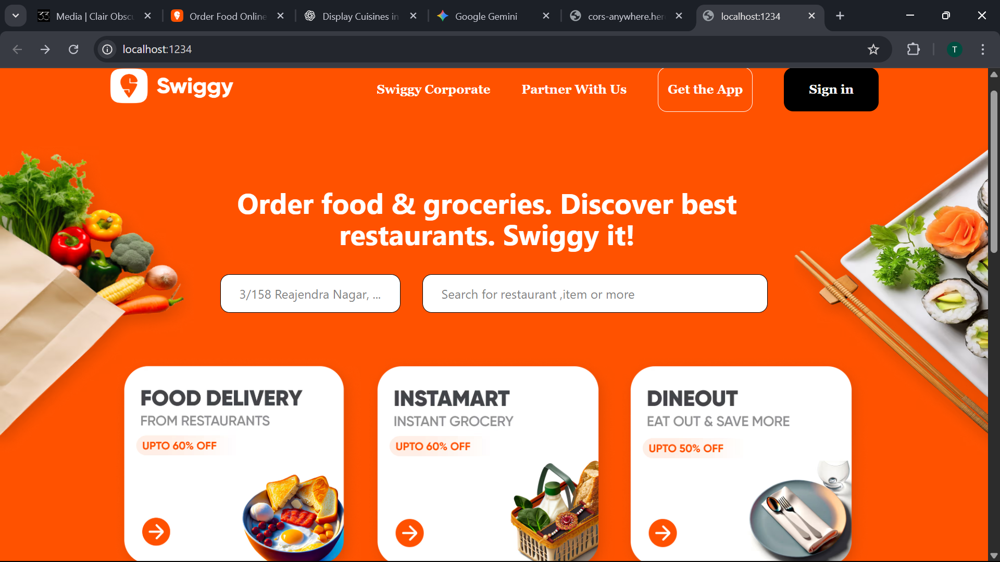
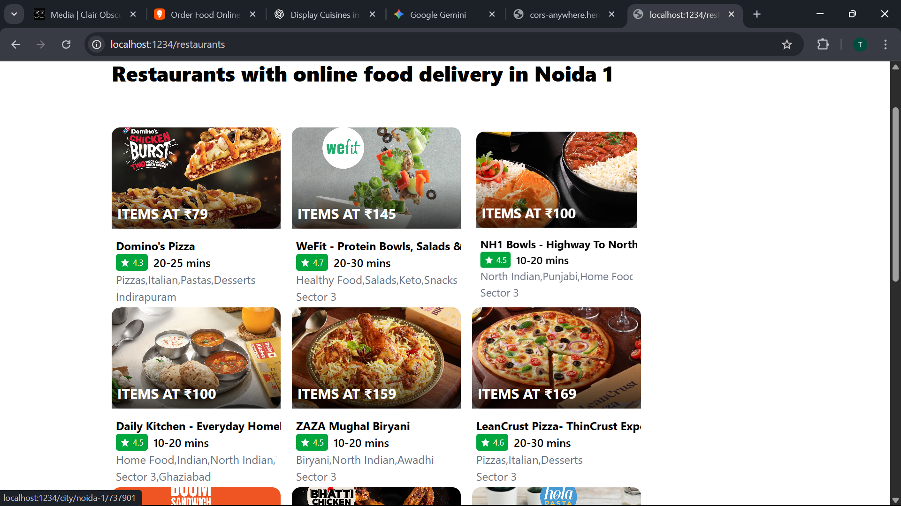
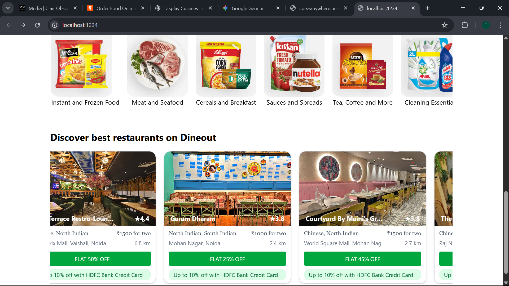
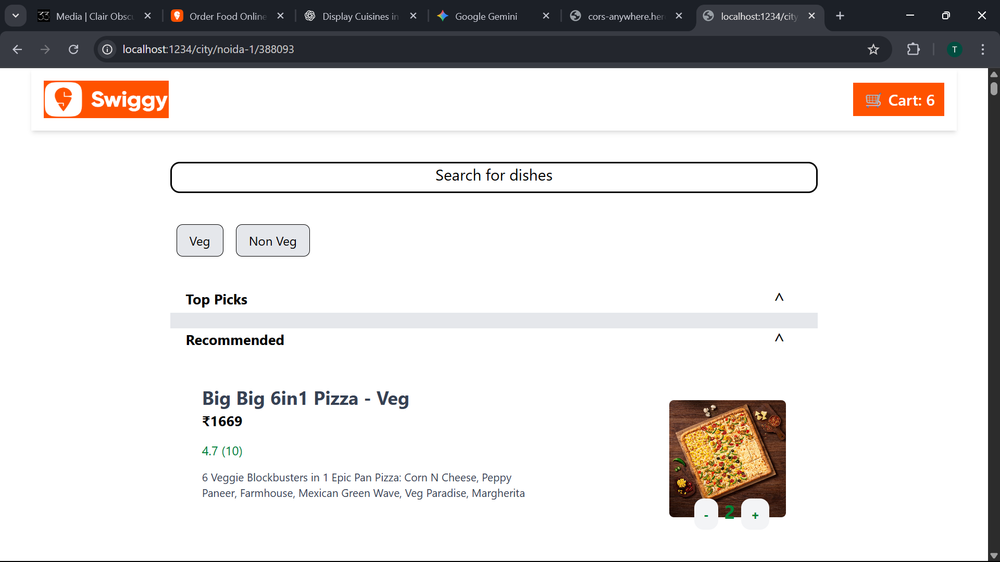
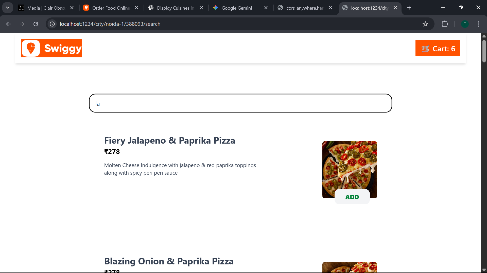
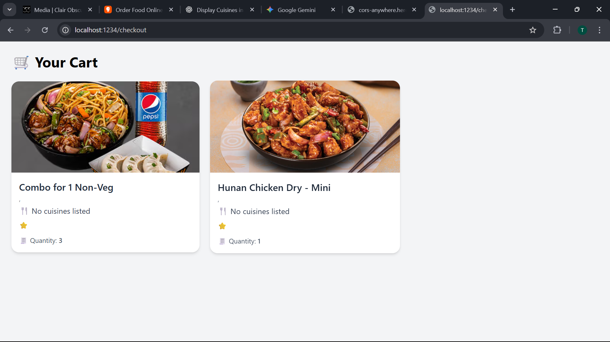

# 🍔 Swiggy Clone – React Frontend

A full-fledged and responsive Swiggy clone built using **React.js**, **Tailwind CSS**, and **Parcel**. This project demonstrates advanced API integration, real-time search, layered data flow, and stateful UI for food ordering experiences.

---

## 🚀 Features

- ⚛️ Built with **React.js** (No Create React App)
- 🌈 Styled using **Tailwind CSS**
- ⚡ Bundled via **Parcel**
- 🔄 Dynamic dish **search functionality**
- 🍽️ Menu rendered from **live Swiggy API**
- 🛒 Cart logic handled with **React state**
- 🧠 Clean and layered **API + component design**
- 📱 Fully responsive across devices

---

## 📁 Folder Structure

```bash
.
├── src/
│   ├── components/        # Reusable components (MenuItem, SearchBox, etc.)
│   └── utils/             # API utils, helper functions
├── index.html             # Main HTML file
├── app.js                 # React App entry point
├── index.css              # Global styles (Tailwind import)
├── tailwind.config.js     # Tailwind configuration
├── package.json
├── .gitignore
└── README.md

🛠️ Getting Started
1. Clone the Repository
bash
Copy
Edit
git clone https://github.com/darkEagle004/Swiggy_clone.git
cd Swiggy_clone
2. Install Dependencies
bash
Copy
Edit
npm install
3. Start Development Server
bash
Copy
Edit
npm start
Open http://localhost:1234 in your browser.

🌐 Deployment
This app can be deployed on Netlify, Vercel, or any static host.

To create a production build:

bash
Copy
Edit
npm run build
Parcel will bundle your app in the dist/ folder.

📦 Built With
React

Tailwind CSS

Parcel

Swiggy API (Unofficial)

## 🙋‍♂️ Author

**Tushar Gupta**  
🎓 B.Tech CSE (2026), KIET Group of Institutions  
🌐 [GitHub](https://github.com/tushar0067)  
🔗 [LinkedIn](https://www.linkedin.com/in/tushar-gupta-7a6951250/)  
📍 Ghaziabad, India

📜 License
This project is for educational use only and not affiliated with Swiggy.

yaml
Copy
Edit

---

Let me know if you'd like me to add:

## 📸 Screenshots

### 🏠 Home Page


### 🍴 Restaurant Menu


### 🛒 Dineout Functionality


### 🛒 FoodItems Functionality


### 🛒 SearchFood Functionality


### 🛒 Cart Functionality



- Live demo badge  
- `.env` instructions if you ever use secrets  
- Redux setup info (if later added)


